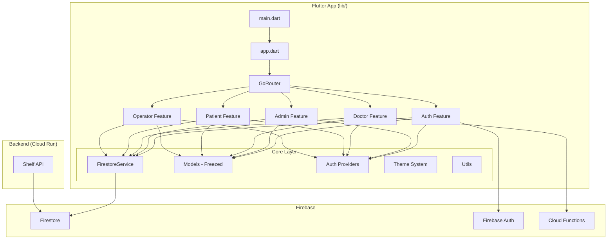
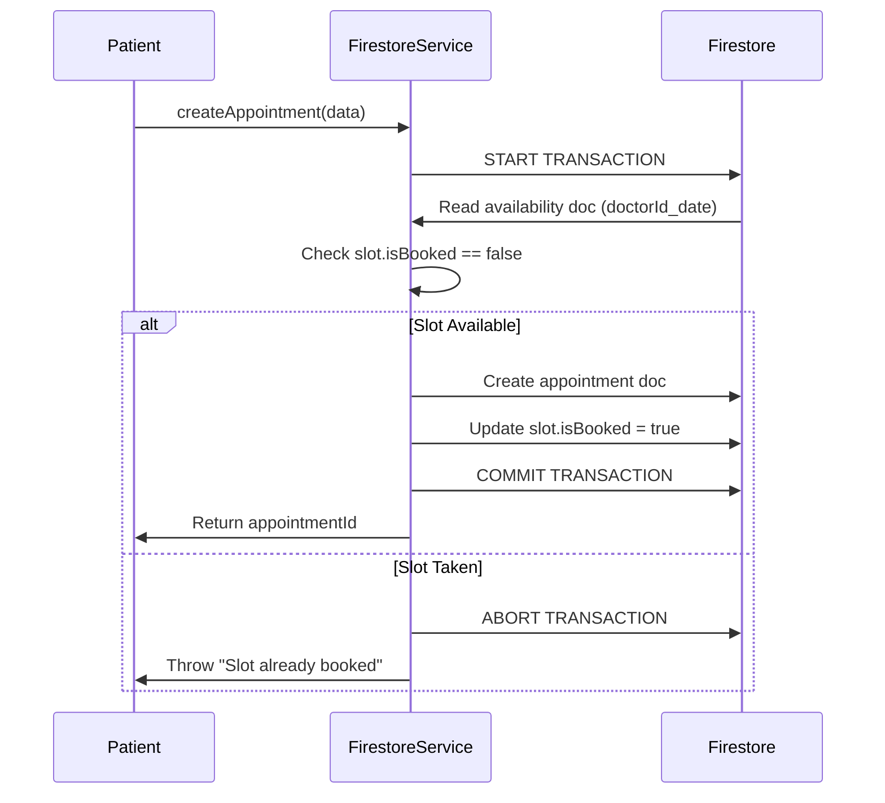
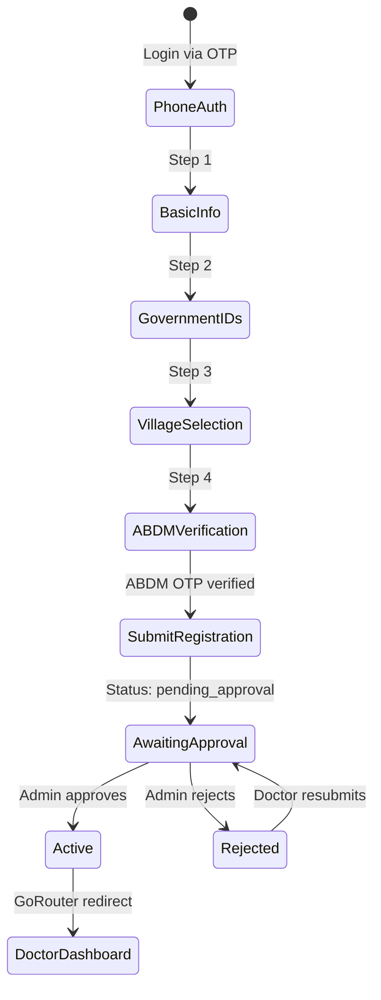

# Gram Aarogya Seva — Complete Project Audit & Context Refresh

> [!WARNING]
> **SUPERSEDED — historical snapshot, retained for provenance.**
> Read [TECHNICAL_ASSESSMENT.md](TECHNICAL_ASSESSMENT.md) instead.
>
> This document describes the codebase as it stood in July 2026 and is now
> wrong in several material ways: it presents the archived Dart Shelf service
> in `_archived/backend/` as live architecture, it reports zero test coverage
> (there are Dart unit tests and an emulator-backed security-rules suite), and
> several of the defects in its §7 have since been fixed. Most importantly, it
> predates the move of all privileged writes to Cloud Functions, so its
> description of the data-flow is no longer accurate.
>
> `TECHNICAL_ASSESSMENT.md` §12 lists every specific inaccuracy.

> **Audit Date**: July 2026  
> **Auditor Perspective**: Senior Software Architect / Principal Engineer  
> **Project Mission**: Rural Healthcare Appointment System for Unnat Bharat Abhiyan (UBA)

---

## 1. Executive Summary

Gram Aarogya Seva (GAS) is a **Flutter + Firebase** mobile application for rural India that digitizes doctor–patient appointment workflows. The system serves **four user roles** (Admin, Doctor, Patient, Operator) with distinct flows. It is backed by **Firestore** (offline-first), **Firebase Phone Auth**, **Cloud Functions** (ABDM Aadhaar verification), and an optional **Dart Shelf backend** (Cloud Run) for server-side enforcement.

### Current Maturity

| Area | Maturity | Notes |
|------|----------|-------|
| Data Models | ★★★★☆ | Freezed + json_serializable, well-structured |
| Auth & Routing | ★★★★☆ | Phone OTP, role-based GoRouter, offline-aware |
| Admin Module | ★★★★☆ | Full CRUD for villages, health centers, doctors, roles |
| Doctor Module | ★★★★☆ | Registration, availability, appointment management |
| Patient Module | ★★★☆☆ | Booking flow complete, profile & records partial |
| Operator Module | ★★★☆☆ | Assisted booking, patient registration |
| Backend (Cloud Run) | ★★★☆☆ | Well-structured but may not be actively used by client |
| Cloud Functions | ★★★☆☆ | ABDM OTP + admin bootstrap; minimal |
| Firestore Rules | ★★★★☆ | Comprehensive role-based with `onlyChanges()` guards |
| Design System | ★★★★☆ | Cohesive green/healing theme, rural-optimized UX |
| i18n | ★★★★☆ | English, Marathi, Hindi — 96 translation keys |
| Testing | ☆☆☆☆☆ | **No tests exist** |

---

## 2. Architecture Overview



### Key Architectural Constraints

1. **`cloud_firestore` imports are restricted to `FirestoreService` only** (and `TimestampConverter`)
2. **Offline-first**: Firestore persistence enabled with `CACHE_SIZE_UNLIMITED`
3. **Feature-first folder structure**: `lib/features/{role}/`
4. **State management**: Riverpod (`StateNotifier`, `StreamProvider`, `FutureProvider`)
5. **Navigation**: GoRouter with custom `Listenable` refresh stream for role-based redirects

---

## 3. Complete File Inventory

### 3.1 Root Configuration

| File | Purpose | Status |
|------|---------|--------|
| [pubspec.yaml](file:///d:/uba_app/gram_aarogya_seva/pubspec.yaml) | Flutter dependencies, SDK ^3.8.0 | ✅ Clean |
| [firebase.json](file:///d:/uba_app/gram_aarogya_seva/firebase.json) | Firebase project config (emulators, hosting) | ✅ Clean |
| [firestore.rules](file:///d:/uba_app/gram_aarogya_seva/firestore.rules) | Firestore security rules | ✅ Comprehensive |
| [firestore.indexes.json](file:///d:/uba_app/gram_aarogya_seva/firestore.indexes.json) | 8 composite indexes | ✅ Matches queries |
| [analysis_options.yaml](file:///d:/uba_app/gram_aarogya_seva/analysis_options.yaml) | Lint config | ✅ Clean |

---

### 3.2 Core Layer (`lib/core/`)

#### Entry Points

| File | Purpose |
|------|---------|
| [main.dart](file:///d:/uba_app/gram_aarogya_seva/lib/main.dart) | Firebase init, EasyLocalization setup, ProviderScope |
| [app.dart](file:///d:/uba_app/gram_aarogya_seva/lib/app.dart) | MaterialApp.router, theme, locale config |

#### Configuration

| File | Purpose |
|------|---------|
| [app_constants.dart](file:///d:/uba_app/gram_aarogya_seva/lib/core/config/app_constants.dart) | Collection names, roles, statuses, routes — single source of truth |

#### Router

| File | Purpose |
|------|---------|
| [app_router.dart](file:///d:/uba_app/gram_aarogya_seva/lib/core/router/app_router.dart) | GoRouter with role-based redirect, 19 routes, auth guard |

> [!IMPORTANT]
> The router uses a custom `_GoRouterRefreshStream` that combines `FirebaseAuth.authStateChanges()` with Firestore user document streams for real-time role-based redirection.

#### Providers

| File | Purpose |
|------|---------|
| [auth_providers.dart](file:///d:/uba_app/gram_aarogya_seva/lib/core/providers/auth_providers.dart) | `authStateProvider`, `userDocProvider`, `firestoreServiceProvider` |

#### Data Models (all Freezed + json_serializable)

| Model | File | Collection | Key Fields |
|-------|------|------------|------------|
| `UserModel` | [user_model.dart](file:///d:/uba_app/gram_aarogya_seva/lib/core/models/user_model.dart) | `users` | uid, phone, name, role, fcmToken |
| `DoctorModel` | [doctor_model.dart](file:///d:/uba_app/gram_aarogya_seva/lib/core/models/doctor_model.dart) | `doctors` | doctorId, nmrId, hprId, aadhaarHash, villages[], status |
| `PatientModel` | [patient_model.dart](file:///d:/uba_app/gram_aarogya_seva/lib/core/models/patient_model.dart) | `patients` | patientId, userId, name, aadhaarHash, villageId, intakeForm |
| `AppointmentModel` | [appointment_model.dart](file:///d:/uba_app/gram_aarogya_seva/lib/core/models/appointment_model.dart) | `appointments` | appointmentId, patientUserId, doctorId, date, timeSlot, status |
| `AvailabilityModel` | [availability_model.dart](file:///d:/uba_app/gram_aarogya_seva/lib/core/models/availability_model.dart) | `doctor_availability` | doctorId, date, slots[], healthCenterId |
| `SlotModel` | (embedded in AvailabilityModel) | — | time, isBooked, appointmentId |
| `VillageModel` | [village_model.dart](file:///d:/uba_app/gram_aarogya_seva/lib/core/models/village_model.dart) | `villages` | villageId, name, taluka, district, state, isActive |
| `HealthCenterModel` | [health_center_model.dart](file:///d:/uba_app/gram_aarogya_seva/lib/core/models/health_center_model.dart) | `health_centers` | centerId, name, villageId, address, isActive |
| `NotificationModel` | [notification_model.dart](file:///d:/uba_app/gram_aarogya_seva/lib/core/models/notification_model.dart) | `notifications` | userId, title, body, type, isRead |

> All models use `TimestampConverter` from [timestamp_converter.dart](file:///d:/uba_app/gram_aarogya_seva/lib/core/models/timestamp_converter.dart) for Firestore `Timestamp` ↔ `DateTime` serialization.

#### Services

| File | Purpose | Lines |
|------|---------|-------|
| [firestore_service.dart](file:///d:/uba_app/gram_aarogya_seva/lib/core/services/firestore_service.dart) | **Single Firestore abstraction** — all CRUD, streams, transactions | ~785 |

> [!IMPORTANT]
> `FirestoreService` is the **brain** of the data layer. It contains:
> - Transactional appointment booking with double-booking prevention (lines ~350-500)
> - Transactional cancellation with slot-freeing
> - 30+ methods covering all collections
> - `countDocuments()` for dashboard stats
> - Search methods for patients and users

#### Theme

| File | Purpose |
|------|---------|
| [app_theme.dart](file:///d:/uba_app/gram_aarogya_seva/lib/core/theme/app_theme.dart) | ThemeData with "Healing Deep Green" palette, Material3 |
| [app_colors.dart](file:///d:/uba_app/gram_aarogya_seva/lib/core/theme/app_colors.dart) | Full color system with status colors, gradients |
| [app_text_styles.dart](file:///d:/uba_app/gram_aarogya_seva/lib/core/theme/app_text_styles.dart) | Typography scale using 'Outfit' + 'Inter' fonts |

#### Utilities

| File | Purpose |
|------|---------|
| [crypto_utils.dart](file:///d:/uba_app/gram_aarogya_seva/lib/core/utils/crypto_utils.dart) | HMAC-SHA256 Aadhaar hashing, masking, last-four extraction |
| [date_utils.dart](file:///d:/uba_app/gram_aarogya_seva/lib/core/utils/date_utils.dart) | Date formatting, 2-hour cancellation window, AM/PM parsing |
| [validators.dart](file:///d:/uba_app/gram_aarogya_seva/lib/core/utils/validators.dart) | Phone, Aadhaar, OTP, NMR ID, HPR ID, required field validators |

---

### 3.3 Shared Widgets (`lib/shared/widgets/`)

| Widget | File | Purpose |
|--------|------|---------|
| `ConfirmationDialog` | [confirmation_dialog.dart](file:///d:/uba_app/gram_aarogya_seva/lib/shared/widgets/confirmation_dialog.dart) | Reusable destructive-action dialog |
| `LanguageToggle` | [language_toggle.dart](file:///d:/uba_app/gram_aarogya_seva/lib/shared/widgets/language_toggle.dart) | AppBar language switcher (EN/MR/HI) |
| `LargeButton` | [large_button.dart](file:///d:/uba_app/gram_aarogya_seva/lib/shared/widgets/large_button.dart) | 60dp gradient action button |
| `NoNetworkBanner` | [no_network_banner.dart](file:///d:/uba_app/gram_aarogya_seva/lib/shared/widgets/no_network_banner.dart) | Offline indicator banner |
| `ProfilePhotoPicker` | [profile_photo_picker.dart](file:///d:/uba_app/gram_aarogya_seva/lib/shared/widgets/profile_photo_picker.dart) | Camera/gallery picker, base64 storage |
| `RuralCard` | [rural_card.dart](file:///d:/uba_app/gram_aarogya_seva/lib/shared/widgets/rural_card.dart) | Borderless tonal card component |
| `StatusBadge` | [status_badge.dart](file:///d:/uba_app/gram_aarogya_seva/lib/shared/widgets/status_badge.dart) | Colored status indicator with icon |

---

### 3.4 Feature Modules (`lib/features/`)

#### Auth Feature (`lib/features/auth/`)

| File | Purpose | SRS Reference |
|------|---------|---------------|
| [auth_notifier.dart](file:///d:/uba_app/gram_aarogya_seva/lib/features/auth/auth_notifier.dart) | Phone OTP state machine (idle → sendingOtp → otpSent → verifying → success) | §11.2/§11.3 |
| [splash_screen.dart](file:///d:/uba_app/gram_aarogya_seva/lib/features/auth/splash_screen.dart) | Firebase loading screen with Hindi branding | — |
| [phone_input_screen.dart](file:///d:/uba_app/gram_aarogya_seva/lib/features/auth/phone_input_screen.dart) | +91 phone input with language selector | P-FLOW-01 |
| [otp_verification_screen.dart](file:///d:/uba_app/gram_aarogya_seva/lib/features/auth/otp_verification_screen.dart) | 6-digit OTP, 30s resend timer, auto-creates user doc | P-FLOW-01 |

#### Doctor Registration (`lib/features/doctor_registration/`)

| File | Purpose | SRS Reference |
|------|---------|---------------|
| [doctor_reg_notifier.dart](file:///d:/uba_app/gram_aarogya_seva/lib/features/doctor_registration/doctor_reg_notifier.dart) | 4-step form state machine | D-FLOW-01 |
| [doctor_registration_screen.dart](file:///d:/uba_app/gram_aarogya_seva/lib/features/doctor_registration/doctor_registration_screen.dart) | Multi-step form: Basic Info → Gov IDs → Villages → ABDM Verification | D-FLOW-01 |
| [awaiting_approval_screen.dart](file:///d:/uba_app/gram_aarogya_seva/lib/features/doctor_registration/awaiting_approval_screen.dart) | Streams doctor doc for auto-navigation on approval/rejection | D-FLOW-01 |

#### Admin Feature (`lib/features/admin/`) — 9 files

| File | Purpose | SRS Reference |
|------|---------|---------------|
| [admin_providers.dart](file:///d:/uba_app/gram_aarogya_seva/lib/features/admin/admin_providers.dart) | Dashboard stats, streams, search providers | — |
| [admin_dashboard_screen.dart](file:///d:/uba_app/gram_aarogya_seva/lib/features/admin/admin_dashboard_screen.dart) | Stat cards + navigation grid to 7 admin modules | A-FLOW-01 |
| [pending_approvals_screen.dart](file:///d:/uba_app/gram_aarogya_seva/lib/features/admin/pending_approvals_screen.dart) | Approve/reject doctors with rejection notes | A-FLOW-01 §3 |
| [village_management_screen.dart](file:///d:/uba_app/gram_aarogya_seva/lib/features/admin/village_management_screen.dart) | Village CRUD (create, deactivate) | A-FLOW-01 §4 |
| [health_center_management_screen.dart](file:///d:/uba_app/gram_aarogya_seva/lib/features/admin/health_center_management_screen.dart) | Health centre CRUD with village filter | A-FLOW-01 |
| [manage_doctors_screen.dart](file:///d:/uba_app/gram_aarogya_seva/lib/features/admin/manage_doctors_screen.dart) | View all doctors | — |
| [view_patients_screen.dart](file:///d:/uba_app/gram_aarogya_seva/lib/features/admin/view_patients_screen.dart) | Search/view patients | — |
| [monitor_appointments_screen.dart](file:///d:/uba_app/gram_aarogya_seva/lib/features/admin/monitor_appointments_screen.dart) | System-wide appointment monitoring with status filter | — |
| [role_management_screen.dart](file:///d:/uba_app/gram_aarogya_seva/lib/features/admin/role_management_screen.dart) | Search user by phone, change role | A-FLOW-01 §5 |

#### Doctor Feature (`lib/features/doctor/`) — 4 files

| File | Purpose | SRS Reference |
|------|---------|---------------|
| [doctor_providers.dart](file:///d:/uba_app/gram_aarogya_seva/lib/features/doctor/doctor_providers.dart) | Profile stream, today's appointments, filtered appointments, availability | — |
| [doctor_dashboard_screen.dart](file:///d:/uba_app/gram_aarogya_seva/lib/features/doctor/doctor_dashboard_screen.dart) | Greeting, quick actions, today's queue with mini stats | D-FLOW-02 |
| [availability_management_screen.dart](file:///d:/uba_app/gram_aarogya_seva/lib/features/doctor/availability_management_screen.dart) | Calendar picker + time slot grid (14 predefined slots) | D-FLOW-03 |
| [doctor_appointments_screen.dart](file:///d:/uba_app/gram_aarogya_seva/lib/features/doctor/doctor_appointments_screen.dart) | Accept/reject/complete/no-show with prep instructions | D-FLOW-02/03/04/05 |

#### Patient Feature (`lib/features/patient/`) — 4 files

| File | Purpose | SRS Reference |
|------|---------|---------------|
| [patient_providers.dart](file:///d:/uba_app/gram_aarogya_seva/lib/features/patient/patient_providers.dart) | Profile, appointments, booking flow state providers | — |
| [patient_dashboard_screen.dart](file:///d:/uba_app/gram_aarogya_seva/lib/features/patient/patient_dashboard_screen.dart) | Profile card, book button, appointment list with cancel | P-FLOW-01 |
| [patient_profile_screen.dart](file:///d:/uba_app/gram_aarogya_seva/lib/features/patient/patient_profile_screen.dart) | Patient registration/edit form | P-FLOW-01 |
| [book_appointment_screen.dart](file:///d:/uba_app/gram_aarogya_seva/lib/features/patient/book_appointment_screen.dart) | 4-step booking: Village → Doctor → Date/Slot → Confirm | P-FLOW-02 |

#### Operator Feature (`lib/features/operator/`) — 4 files

| File | Purpose | SRS Reference |
|------|---------|---------------|
| [operator_providers.dart](file:///d:/uba_app/gram_aarogya_seva/lib/features/operator/operator_providers.dart) | Today's bookings, booking flow providers | — |
| [operator_dashboard_screen.dart](file:///d:/uba_app/gram_aarogya_seva/lib/features/operator/operator_dashboard_screen.dart) | Quick actions + today's bookings | O-FLOW-01 |
| [operator_register_patient_screen.dart](file:///d:/uba_app/gram_aarogya_seva/lib/features/operator/operator_register_patient_screen.dart) | Assisted patient registration | O-FLOW-02 |
| [operator_book_appointment_screen.dart](file:///d:/uba_app/gram_aarogya_seva/lib/features/operator/operator_book_appointment_screen.dart) | Assisted booking on behalf of patient | O-FLOW-03 |

---

### 3.5 Backend — Dart Shelf API (`backend/`)

| File | Purpose |
|------|---------|
| [server.dart](file:///d:/uba_app/gram_aarogya_seva/backend/bin/server.dart) | Cloud Run entry point, PORT binding |
| [app.dart](file:///d:/uba_app/gram_aarogya_seva/backend/lib/app.dart) | Middleware pipeline: CORS → Logging → Auth → Router |
| [appointment_handler.dart](file:///d:/uba_app/gram_aarogya_seva/backend/lib/handlers/appointment_handler.dart) | Server-side atomic booking, 2hr cancel window, status transitions |
| [availability_handler.dart](file:///d:/uba_app/gram_aarogya_seva/backend/lib/handlers/availability_handler.dart) | Get/set slots with booked-slot merge protection |
| [doctor_handler.dart](file:///d:/uba_app/gram_aarogya_seva/backend/lib/handlers/doctor_handler.dart) | Register, approve, reject with admin role verification |
| [health_check_handler.dart](file:///d:/uba_app/gram_aarogya_seva/backend/lib/handlers/health_check_handler.dart) | `/health` liveness probe |
| [auth_middleware.dart](file:///d:/uba_app/gram_aarogya_seva/backend/lib/middleware/auth_middleware.dart) | Firebase JWT validation (uses Google tokeninfo endpoint) |
| [cors_middleware.dart](file:///d:/uba_app/gram_aarogya_seva/backend/lib/middleware/cors_middleware.dart) | CORS headers for web/dev |
| [logging_middleware.dart](file:///d:/uba_app/gram_aarogya_seva/backend/lib/middleware/logging_middleware.dart) | Structured JSON logging for Cloud Logging |
| [firestore_admin.dart](file:///d:/uba_app/gram_aarogya_seva/backend/lib/services/firestore_admin.dart) | Firebase Admin SDK singleton |
| [Dockerfile](file:///d:/uba_app/gram_aarogya_seva/backend/Dockerfile) | Multi-stage build for Cloud Run |
| [pubspec.yaml](file:///d:/uba_app/gram_aarogya_seva/backend/pubspec.yaml) | Backend deps: shelf, firebase_admin_sdk |

> [!WARNING]
> The backend auth middleware uses Google's `tokeninfo` endpoint for JWT validation — this is a **development shortcut**. Production should use Firebase Admin SDK for local verification with cached public keys.

---

### 3.6 Cloud Functions (`functions/`)

| File | Purpose |
|------|---------|
| [index.ts](file:///d:/uba_app/gram_aarogya_seva/functions/src/index.ts) | 3 functions: `abdmRequestAadhaarOtp`, `abdmVerifyAadhaarOtp`, `bootstrapAdmin` |
| [package.json](file:///d:/uba_app/gram_aarogya_seva/functions/package.json) | Node 24, firebase-functions v7, axios |

> Functions are deployed to `asia-south1` region. ABDM calls use sandbox URLs (`healthidsbx.abdm.gov.in`).

---

### 3.7 Localization (`assets/l10n/`)

| File | Language | Keys |
|------|----------|------|
| [en.json](file:///d:/uba_app/gram_aarogya_seva/assets/l10n/en.json) | English | 96 keys |
| [mr.json](file:///d:/uba_app/gram_aarogya_seva/assets/l10n/mr.json) | Marathi | 96 keys |
| [hi.json](file:///d:/uba_app/gram_aarogya_seva/assets/l10n/hi.json) | Hindi | 96 keys |

---

## 4. Data Flow Diagrams

### 4.1 Appointment Booking (Critical Transaction)



### 4.2 Doctor Registration Flow



---

## 5. Firestore Schema

### Collections

| Collection | Document ID | Key Relationships |
|------------|-------------|-------------------|
| `users` | `{uid}` | Links to `doctors`, `patients` by UID |
| `doctors` | `{uid}` | Has `villages: string[]` → `villages` collection |
| `patients` | Auto-ID | Has `userId` → `users`, `villageId` → `villages` |
| `villages` | Auto-ID | Referenced by doctors, patients, health centers |
| `health_centers` | Auto-ID | Has `villageId` → `villages` |
| `doctor_availability` | `{doctorId}_{date}` | Has `slots[]` with `appointmentId` back-ref |
| `appointments` | Auto-ID | Links `patientUserId`, `doctorId`, `healthCenterId` |
| `notifications` | Auto-ID | Has `userId` for delivery |
| `abdm_rate_limits` | `{uid}` | Rate limiting (Cloud Functions only) |

### Composite Indexes (8 total)

All on `appointments` and `doctor_availability` — covering:
- Doctor + date queries
- Doctor + status + date queries  
- Patient + date queries
- Status + date queries
- Operator + date queries
- Notification user + createdAt queries

---

## 6. Security Rules Summary

| Collection | Read | Write | Notes |
|------------|------|-------|-------|
| `users` | Owner + Admin | Owner (no role change) / Admin (role only) | `onlyChanges()` enforced |
| `doctors` | Auth (with status gate) | Owner (profile fields) / Admin (status fields) | Field-level control |
| `patients` | Admin + Op + Doctor + Owner | Patient + Operator (create) / same (update) | Doctor added for appointment lookup |
| `doctor_availability` | Auth | Doctor (own) / Admin / Operator / Patient (booking tx) | Patient needs update for `isBooked` |
| `appointments` | Role-scoped | Doctor (status transitions) / Patient/Op (cancel only) / Admin | Cancel requires `status == 'cancelled'` |
| `notifications` | Owner only | Admin (create) / Owner (`isRead` only) | Server-side creation preferred |
| `abdm_rate_limits` | None | None | Cloud Functions only |

---

## 7. Technical Debt & Issues

### 🔴 Critical

| # | Issue | Location | Impact |
|---|-------|----------|--------|
| 1 | **Zero test coverage** | Entire project | Cannot verify correctness, blocks CI/CD |
| 2 | **Hardcoded HMAC secret** | [doctor_registration_screen.dart:495](file:///d:/uba_app/gram_aarogya_seva/lib/features/doctor_registration/doctor_registration_screen.dart#L495) | `'gas-hmac-secret-v1'` in source code — security risk |
| 3 | **Backend auth uses tokeninfo endpoint** | [auth_middleware.dart:31](file:///d:/uba_app/gram_aarogya_seva/backend/lib/middleware/auth_middleware.dart#L31) | Network call per request, not production-ready |

### 🟠 High

| # | Issue | Location | Impact |
|---|-------|----------|--------|
| 4 | **Resend OTP sends empty phone** | [otp_verification_screen.dart:72](file:///d:/uba_app/gram_aarogya_seva/lib/features/auth/otp_verification_screen.dart#L72) | `sendOtp('')` — relies on resendToken but phone is required |
| 5 | **Duplicate `CryptoUtils2` class** | [awaiting_approval_screen.dart:236](file:///d:/uba_app/gram_aarogya_seva/lib/features/doctor_registration/awaiting_approval_screen.dart#L236) | Unnecessary duplication, should use `CryptoUtils` |
| 6 | **Profile photo as base64 in Firestore** | [profile_photo_picker.dart](file:///d:/uba_app/gram_aarogya_seva/lib/shared/widgets/profile_photo_picker.dart) | Document size concerns (max 1MB), should use Firebase Storage |
| 7 | **`NoNetworkBanner` not localized** | [no_network_banner.dart:21](file:///d:/uba_app/gram_aarogya_seva/lib/shared/widgets/no_network_banner.dart#L21) | Hardcoded English text |
| 8 | **Client-side dual data path** | FirestoreService + Backend handlers | Same logic duplicated — unclear which path is primary |

### 🟡 Medium

| # | Issue | Location | Impact |
|---|-------|----------|--------|
| 9 | **`todayAppointments` stat missing** | [admin_providers.dart:46](file:///d:/uba_app/gram_aarogya_seva/lib/features/admin/admin_providers.dart#L46) | `DashboardStats.todayAppointments` always 0 |
| 10 | **ABDM sandbox URLs in production** | [index.ts:11](file:///d:/uba_app/gram_aarogya_seva/functions/src/index.ts#L11) | `healthidsbx.abdm.gov.in` — must switch for production |
| 11 | **CORS allows all origins** | [cors_middleware.dart:19](file:///d:/uba_app/gram_aarogya_seva/backend/lib/middleware/cors_middleware.dart#L19) | `Access-Control-Allow-Origin: *` |
| 12 | **Missing health center selection** | [availability_management_screen.dart:192](file:///d:/uba_app/gram_aarogya_seva/lib/features/doctor/availability_management_screen.dart#L192) | Empty `healthCenterId` in availability |
| 13 | **`_PatientAppointmentCard` uses `dynamic`** | [patient_dashboard_screen.dart:199](file:///d:/uba_app/gram_aarogya_seva/lib/features/patient/patient_dashboard_screen.dart#L199) | Type safety lost |
| 14 | **Hardcoded strings in UI** | Multiple screens | Many UI strings not going through `tr()` localization |

### 🟢 Low / Improvement

| # | Issue | Location | Impact |
|---|-------|----------|--------|
| 15 | **No pagination** | Admin list screens | Will degrade with scale |
| 16 | **No FCM notifications** | Marked as TODO in backend | Doctor approval, appointment reminders missing |
| 17 | **No health records feature** | — | Referenced in translations but not implemented |
| 18 | **Generated `.g.dart` / `.freezed.dart` files** | `lib/core/models/` | 8 generated files checked in — consider `.gitignore` |

---

## 8. Dependency Audit

### Flutter App (pubspec.yaml)

| Package | Version | Purpose | Risk |
|---------|---------|---------|------|
| flutter_riverpod | ^2.6.1 | State management | ✅ Stable |
| go_router | ^14.8.1 | Navigation | ✅ Stable |
| firebase_core | ^3.14.0 | Firebase init | ✅ |
| firebase_auth | ^5.6.0 | Phone OTP auth | ✅ |
| cloud_firestore | ^5.6.7 | Database | ✅ |
| cloud_functions | ^5.3.6 | ABDM calls | ✅ |
| easy_localization | ^3.0.7+1 | i18n | ✅ |
| freezed_annotation | ^2.4.4 | Models | ✅ |
| json_annotation | ^4.9.0 | JSON serialization | ✅ |
| image_picker | ^1.1.2 | Profile photos | ✅ |
| table_calendar | ^3.2.0 | Availability calendar | ✅ |
| crypto | ^3.0.6 | HMAC hashing | ✅ |
| connectivity_plus | ^6.1.4 | Network detection | ✅ |
| google_fonts | ^6.2.1 | Typography | ✅ |

### Backend (pubspec.yaml)

| Package | Version | Purpose | Risk |
|---------|---------|---------|------|
| shelf | ^1.4.2 | HTTP server | ✅ |
| shelf_router | ^1.1.4 | Routing | ✅ |
| firebase_admin_sdk | ^0.5.1 | Firestore admin access | ⚠️ Pre-1.0 |

### Cloud Functions (package.json)

| Package | Version | Purpose | Risk |
|---------|---------|---------|------|
| firebase-functions | ^7.0.0 | Cloud Functions v2 | ✅ |
| firebase-admin | ^13.6.0 | Admin SDK | ✅ |
| axios | ^1.15.2 | HTTP client for ABDM | ✅ |

---

## 9. Feature Completion Matrix

| Feature | Admin | Doctor | Patient | Operator |
|---------|-------|--------|---------|----------|
| Dashboard | ✅ | ✅ | ✅ | ✅ |
| Auth (Phone OTP) | ✅ | ✅ | ✅ | ✅ |
| Profile Management | N/A | ✅ (via reg) | ✅ | N/A |
| Village CRUD | ✅ | — | — | — |
| Health Centre CRUD | ✅ | — | — | — |
| Doctor Registration | — | ✅ (4-step) | — | — |
| Doctor Approval | ✅ | — | — | — |
| ABDM Verification | — | ✅ | — | — |
| Availability Management | — | ✅ | — | — |
| Book Appointment | — | — | ✅ | ✅ (assisted) |
| Cancel Appointment | — | — | ✅ (2hr window) | — |
| Accept/Reject Appointment | — | ✅ | — | — |
| Complete/No-Show | — | ✅ | — | — |
| Patient Registration | — | — | ✅ (self) | ✅ (assisted) |
| Role Management | ✅ | — | — | — |
| Appointment Monitoring | ✅ | — | — | — |
| Notifications/FCM | ❌ TODO | ❌ TODO | ❌ TODO | ❌ TODO |
| Health Records | ❌ | ❌ | ❌ | ❌ |
| Offline Queue | ❌ | ❌ | ❌ | ❌ |

---

## 10. Build & Deploy Checklist

### Flutter App
```bash
# Generate model code
flutter pub run build_runner build --delete-conflicting-outputs

# Run (debug)
flutter run

# Build APK
flutter build apk --release
```

### Cloud Functions
```bash
cd functions
npm install
npm run build
firebase deploy --only functions
```

### Backend (Cloud Run)
```bash
cd backend
docker build -t gas-api .
# Deploy to Cloud Run via gcloud
```

### Firebase
```bash
# Deploy security rules
firebase deploy --only firestore:rules

# Deploy indexes
firebase deploy --only firestore:indexes
```

---

## 11. Key Design Decisions to Remember

1. **Offline-first**: Booking requires network (checked before transaction), but all reads work offline via Firestore cache
2. **Aadhaar is never stored raw**: Only `aadhaarHash` (HMAC-SHA256) and `aadhaarLastFour` are persisted
3. **Appointment IDs in availability slots**: Slots contain `appointmentId` back-references for integrity
4. **Availability doc ID = `{doctorId}_{date}`**: Compound key avoids collection group queries
5. **User role determines routing**: GoRouter's `redirect` reads `users/{uid}.role` and routes to role-specific dashboard
6. **ABDM verification is a Cloud Function**: Keeps API credentials server-side, rate-limited to 60s per user
7. **Admin bootstrap**: One-time `bootstrapAdmin` HTTP function with a shared secret to create the first admin user

---

> [!TIP]
> **Ready to resume development.** This document captures the complete state of the codebase. When continuing work, reference the Technical Debt table (§7) for priority fixes, and the Feature Completion Matrix (§9) for what remains to be built.
